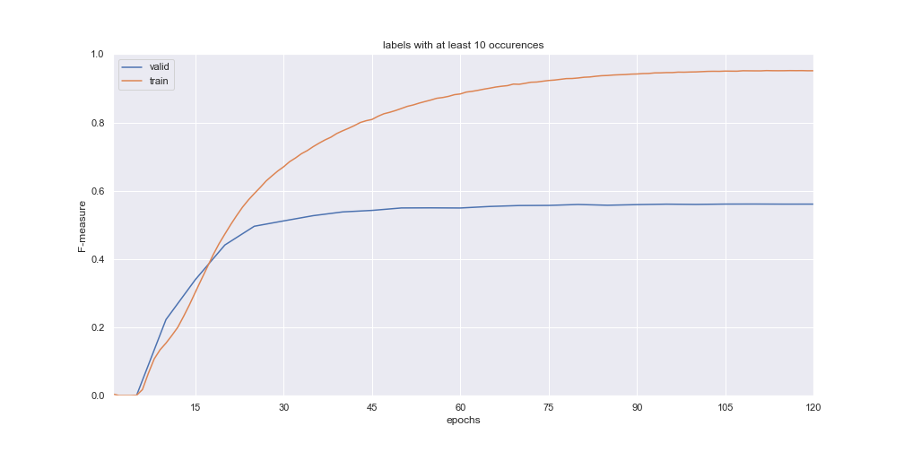

# multi-label-classification-BERT

```
$ docker build -t url-classification .
$ docker run url-classification
```

or 

```
$ pip3 install -r requirements.txt
$ python3 src/train.py
```
*check logs for the output of the above command*

<p align="center">
  
</p>

<p align="center">
  
</p>